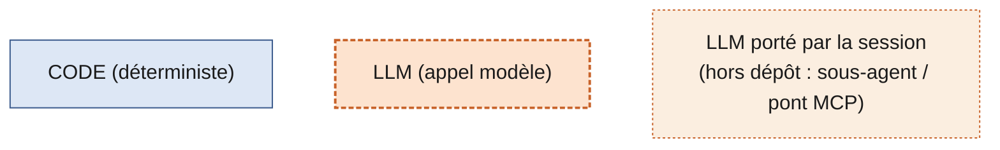
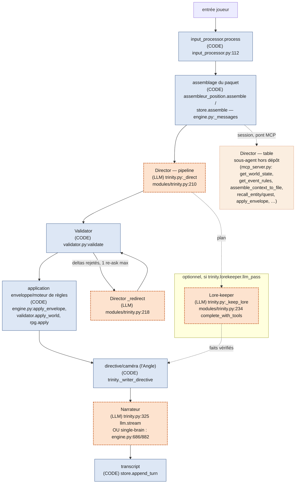
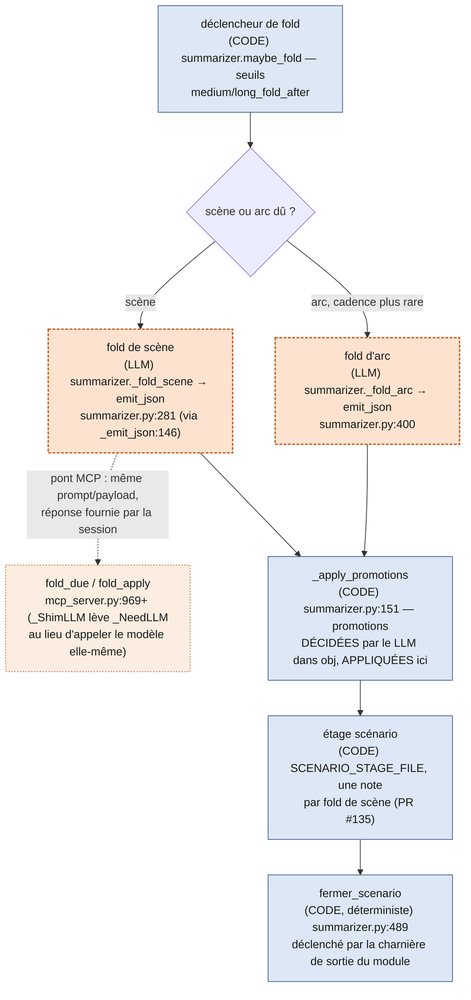
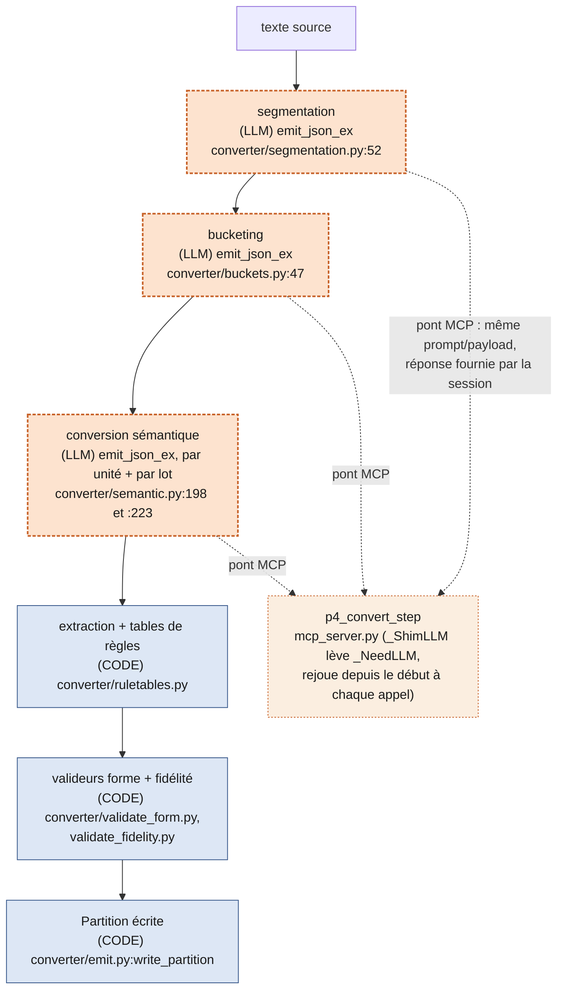
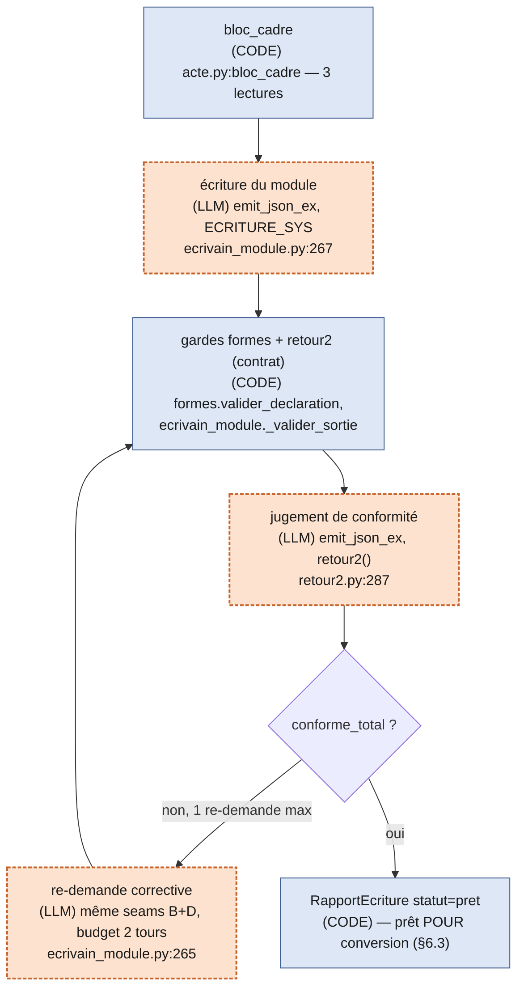
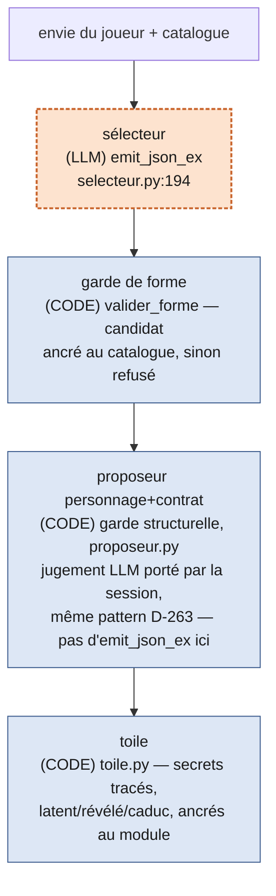

# Architecture — le Director, l'escalier, le vocabulaire

*Premier document à lire par une lane fraîche sur ce dépôt. Écrit après la
mesure (D-258 §3) : chaque chiffre ci-dessous vient d'une mesure déjà rejouée
et versionnée, jamais d'une estimation nouvelle. Enrichi par D-266 (table
campagne↔moteur) et par D-262 (les principes d'écriture de l'Auteur).
Rapport expurgé (D-109/D-178) comme ses sources : aucun extrait de fiction,
aucun nom propre de campagne réel — uniquement des chemins de code et des
tailles agrégées (Issue #157).*

## 1. Le rôle Director, deux corps (D-258/D-263)

**Director** est un RÔLE (ordonnancer · cadrer · écrire par patchs), pas un
fichier ni un process. Ce dépôt l'incarne aujourd'hui dans **deux corps**
distincts, mesurés côte à côte par `docs/mesure-i158-director-deux-corps.md`
(Issue #84) — ne jamais confondre l'un pour l'autre :

### director-de-table — le corps cible du jeu joué

Le corps qui sert réellement une partie aujourd'hui. C'est un **sous-agent**
(dossier `.claude` d'un vault de campagne, hors de ce dépôt), servi par le
**pont MCP** de ce dépôt (`mcp_server.py`) : ses outils (`get_world_state`,
`get_event_rules`, `assemble_context_to_file`, `recall_entity`,
`recall_quest`, `apply_envelope`, `auteur_bloc_cadre`, …) sont la seule
matière que ce corps reçoit — jamais un contexte pré-assemblé dans sa propre
fenêtre.

- **Session au forfait, fenêtre fraîche à chaque tour** : le sous-agent
  Director repart de zéro à chaque invocation — il ne porte AUCUNE mémoire de
  conversation d'un tour au suivant. Ce qui doit survivre entre deux tours a
  été **committé dans le paquet** (l'état du monde, le vécu, la partition) —
  jamais confié à une fenêtre qui grossirait. « Le paquet fait foi, la
  mémoire de conversation est jetable » : c'est la garantie structurelle qui
  rend ce corps mesurable et rejouable tour après tour, contrairement à
  l'orchestrateur/narrateur qui l'entoure (session persistante, ne repart
  jamais à neuf — `docs/mesure-i158-director-deux-corps.md` §4, la fenêtre
  qui accumule jusqu'à relance manuelle, hors périmètre du Director
  lui-même).
- Jugement **distribué** sur plusieurs décisions explicites par tour : quels
  faits chercher (direct ou sous-agent `documentaliste`), le tranchage du
  lore servi au narrateur (`context_candidates` → `lore_include`), l'enveloppe
  mécanique, la génération de l'Angle — rien de tout cela n'a d'équivalent
  dans l'autre corps.

### director-pipeline (`coderain/modules/trinity.py`) — le banc mesurable

Le pipeline « Quad » (`TrinityBrain`, `DIRECTOR_SYS`) : un unique appel LLM
qui reçoit un contexte **pré-assemblé par du code** (`store.assemble()`) et
doit renvoyer STRICTEMENT un objet JSON (`beat_plan`, `must_stay_consistent`,
`recall_queries`, `envelope`) — zéro appel d'outil, zéro écriture disque.

**PAS un chemin d'exécution au régime actuel — PAS D'API.** `trinity_brain`
n'a jamais tourné sur une save réelle du dépôt privé `ttrpg-corpus`
(`docs/mesure-i158-director-deux-corps.md` §6, trou consigné, pas comblé) :
ce corps est mesuré sur ce qu'il RECEVRAIT (calcul déterministe rejoué), pas
sur un coût réellement encouru en jeu. Son rôle dans ce dépôt est celui d'un
**banc de mesure** — comparer un jugement resserré (une enveloppe JSON, coût
constant, aucune fenêtre à saturer) au jugement distribué de l'autre corps —
pas une alternative servie aux joueurs aujourd'hui. `trinity_test.py` est
d'ailleurs exclu de la suite versionnée (voir `CLAUDE.md`, échec préexistant
documenté, I-270).

### Le contrat du Director, commun aux deux corps

Quel que soit le corps, le Director reçoit **trois réalités** en entrée et
produit **trois gestes** en sortie :

| Entrée | Sortie |
|---|---|
| la **partition** (module converti — nodes, records, secrets, règles) | **ordonnancer** (quoi ce tour, dans quel ordre) |
| le **monde/vécu** (état de la save, mémoire promue) | **cadrer** (l'Angle, ce que le joueur perçoit) |
| l'**acte du joueur** (l'entrée du tour) | **écrire par patchs** (l'enveloppe de deltas — `apply_envelope`/`validate_envelope`, jamais une réécriture libre de l'état) |

Une divergence structurelle mesurée entre les deux corps : côté table, le
retrait des règles d'événement et des secrets au narrateur est un **contrat
déclaré** (paramètres nommés `event_rules=False, secrets=False`, testé,
compteur `secrets_suppressed` — `mcp_server.py:1580-1602` cité par la mesure) ;
côté pipeline, le Writer ne les reçoit pas non plus, mais par un **effet de
portée Python** non déclaré (`event_rules_block` reste local à `_direct`),
pas par une politique équivalente (`docs/mesure-i158-director-deux-corps.md`
§2/conclusion 2).

## 2. Les chiffres de la mesure (D-260, `docs/mesure-d260-boucle-neuve.md`)

Ces chiffres portent sur le paquet reçu par le Director côté **pipeline**
(assemblage keyé position, `coderain/assembleur_position.py`) — la mesure la
plus récente disponible, rejouable par `python
tests/mesure-d260-boucle-neuve.py`. Convention constante depuis I-158 :
1 token ≈ 4 caractères (`coderain/memory.py:1309,1544`).

| | I-158 (ancien, `store.assemble()` mots-clés+budget) | Boucle neuve (après lane c, `assembleur_position.py`) |
|---|---:|---:|
| TOTAL paquet Director, corpus synthétique versionné | 19 329 tok | **1 029 tok** |
| TOTAL paquet Director, corpus réel `beyond-the-vale-of-madness` (RPG actif) | 19 329 tok | **4 841 tok** |

- **−75 %** sur le corpus réel (19 329 → 4 841 tok), **−95 %** sur le
  synthétique (19 329 → ≈1 013 tok avant le dernier rejeu de lane c) — cible
  D-260 (−90 %, fourchette 1 500-2 500 tok) **atteinte et dépassée** sur le
  synthétique, **non atteinte** sur le réel (reste au-dessus de la
  fourchette).
- **Part cachable** (préfixe byte-identique d'un tour à l'autre sans
  transition de node) : **56 %** du paquet sur le corpus réel avant le
  dernier rejeu (51 % après — le dénominateur total a rétréci, pas le
  préfixe stable absolu).
- **Les 2 couches résiduelles non résolues** (Issue #144, diagnostic posé,
  PAS corrigé — hors périmètre d'une mesure) expliquent à elles seules
  l'essentiel de l'écart réel restant, parce qu'elles vivent dans
  `engine.py` (`_augment_rpg`/`_augment_style`) et non dans
  `assembleur_position.py` — donc jamais keyées-position :
  1. `rpg-rules.md` **entier** (`_augment_rpg`) — 1 435 tok sur le réel,
     0 tok sur le synthétique (RPG off). Grammaire de l'enveloppe mécanique,
     pas un lorebook narratif sélectionnable par pertinence de scène.
  2. **Style + author's note** (`_augment_style`) — 954 tok sur le réel,
     50 tok sur le synthétique. La note d'auteur est déjà conditionnée par
     `depth`/`every`, mais coûte plein tarif les tours où elle sert et casse
     le cache ces tours-là.

Ce que la boucle neuve a construit, elle le tient (les 3 postes non-construits
d'I-158 — règles en prose, état sans sélection, règles d'événement — sont
tous les trois RÉSOLUS) ; ce qui reste ouvert est un réordonnancement
(rapprocher les blocs vraiment stables du préfixe cachable) et une décision de
découpage socle/annexe sur `rpg-rules.md`, posés en arbitrage à l'Issue #144,
pas tranchés par cette mesure.

## 3. L'escalier et la table de correspondance campagne↔moteur (D-266)

Nomenclature figée (`coderain/converter/schemas.py:16-18`,
`ALTITUDES = ("scene", "scenario", "adventure")` — arc/univers explicitement
BANNIS comme étages, D-122). Cinq notions de campagne, chacune un fichier ou
un module de code précis — jamais de synonymes flottants :

| Notion de campagne | Objet moteur | Fichier(s) |
|---|---|---|
| **scène** | un `node` de la partition | `partition/nodes/<id>.md` (lu par `module_get_node`, servi au Director par `assembleur_position._current_node_section`) |
| **scénario** | l'étage `scenario` de la partition (contenu figé, écrit par le convertisseur) **+** son pendant vécu | partition : étage `scenario` · vécu : `memory/scenario-courant.md` (`coderain/memory.py:113`, ouvert tant qu'un fold ne l'a pas refermé vers le vécu promu) |
| **module** | UNE partition convertie — l'étage `adventure` de cette partition (`ETAGE_GLOBAL`, `schemas.py:19`) : trajectoire par défaut, conditions de monde, **charnière de sortie** | `partition/aventure.md` (classe `Aventure`, `coderain/converter/schemas.py:916-943` ; lu par `module_get_aventure`, `mcp_server.py:1965`) — la charnière de sortie est « une sortie convertie en charnière, jamais une fin » (`schemas.py:922`), obligatoire à la validation (`converter/validate_form.py:119-121`) |
| **ACTE** | 2-3 modules chaînés : jalons + raccord | `coderain/acte.py` (fichier `actes.md`, FRÈRE de `campagne.md`, jamais une extension de son schéma — voir §1 de `acte.py`) ; c'est aussi l'échelle du **candidat d'acte du sélecteur** |
| **campagne** | l'ambition finale + les fils rouges portés | `campagne.py` (`campagne.md` — `ambition_finale` + `fil_rouge[]`, statuts `actif/promu/scelle`) **+** `toile.py` (`toile.md` — les secrets tracés, `latent/revele/caduc`) |

Points de charnière entre étages, tels que le code les porte :

- Le **module** est le seul niveau qui porte une charnière de sortie
  explicite (`Aventure.charniere_md`) — c'est le point où l'ACTE choisit le
  module suivant (`Acte.raccord.module_id` + `raccord.conditions_entree_md`,
  `coderain/acte.py:83-86`).
- L'**ACTE** ne recalcule jamais son propre remplissage : ses jalons sont un
  **record** du dispositif (statut mesuré : vécu/pas-vécu/abandonné), jamais
  redéduits à chaque lecture (`acte.py` §REMPLISSAGE) — comparés au **vécu
  promu** de `memory/aventure.md` (`ADVENTURE_FILE`, `coderain/memory.py:114`)
  présenté à côté, jamais tranché par le code (D-131 : pas de score, pas de
  seuil).
- La **campagne** ne pointe jamais la **toile** ; la toile peut pointer la
  campagne via `rattachement` (référence UNIDIRECTIONNELLE, `toile.py:24-25`).
  Ni l'une ni l'autre ne sont chargées dans un contexte de tour — écrites et
  lues par l'Auteur seul, hors séance (même régime, `campagne.py` §doc et
  `toile.py` §doc).

## 4. Les principes d'écriture (Auteur + convertisseur)

### Le rythme s'hérite, il ne se lisse jamais

Le convertisseur préserve la rythmique NATIVE du module source : l'ellipse
temporelle n'est un outil que quand la PARTITION la déclare explicitement
(`I-121`), **jamais depuis le rythme perçu du joueur**
(`coderain/converter/directeur.py:58-60`, principe 8). Un module qui a été
écrit avec un paroxysme resserré le garde resserré après conversion — ce
n'est pas à l'Auteur ni au convertisseur de l'aplatir pour "égaliser" la
narration.

### Le travail d'auteur, c'est des COUTURES

Deux gestes distincts, jamais confondus (D-262) :

1. **Spécialiser la charnière de sortie** — ce qui a été trouvé/vécu au
   paroxysme du module courant MOTIVE le départ vers le module suivant. La
   charnière n'est pas un connecteur générique ("et puis vous partez") mais
   un texte qui porte la trace de ce qui vient de se jouer
   (`Aventure.charniere_md`, §3 ci-dessus).
2. **L'ENTREMÊLEMENT** — un fil de la toile s'ancre TOUJOURS sur un élément
   DU module (PNJ, objet, lieu) — jamais un élément inventé à côté. C'est
   pour cela que `toile.py` impose `ancre_module` et que
   `assembleur_position._presence_section` sert les secrets **par
   porteurs présents** (`porteurs` du fichier secret, croisé aux records
   ancrés sur le node courant, `coderain/assembleur_position.py:158-178`) —
   une révélation ne se joue jamais "à côté" du module, elle est déjà tissée
   dans son tissu. Une déclaration de forme narrative suit la même
   discipline : DÉCLARÉE (id + justification), jamais convoquée implicitement
   (`coderain/formes.py` §doc, D-261 amendement 2).

### Fondue dans la fiction, séparée dans les registres

La garde anti-méta traverse tout l'escalier : les débouchés/liens d'un node
sont un DÉCOR de possibles perçus, jamais un menu ni un déclencheur
automatique (`assembleur_position._potentials_text`, D-179) ; les secrets
laissent SEULEMENT entrevoir ce qu'un porteur sait, jamais énoncés
(`_presence_section`, D-019) ; le retour 2 (`coderain/retour2.py`) juge la
CONFORMITÉ texte-contre-texte avant que rien ne se joue — jamais un score
agrégé (D-131/D-118), pour que le jugement mécanique et le jugement de
fiction restent deux registres distincts, jamais mélangés dans le même texte.

## 5. Le vocabulaire (pour qu'aucune lane ne confonde plus)

| Terme | Ce que c'est | Ce que ce N'EST PAS |
|---|---|---|
| **Director** | le RÔLE (3 entrées → 3 gestes, §1) | ni un fichier, ni un process unique |
| **director-de-table** | le sous-agent servi par le pont MCP, corps cible du jeu joué aujourd'hui | pas le pipeline ; pas mesuré en tokens de facturation depuis ce dépôt |
| **director-pipeline** | `coderain/modules/trinity.py::TrinityBrain`, banc mesurable | PAS un chemin d'exécution actuel ; PAS d'API |
| **module = aventure = partition** | UNE conversion d'un matériau source, étage `adventure` inclus | pas un scénario (l'étage EN DESSOUS de lui dans l'escalier), pas un acte |
| **acte** | 2-3 modules chaînés, `coderain/acte.py` | pas un fichier de campagne (`campagne.py`), pas un "arc" (banni, D-122) |
| **toile** | les secrets tracés, `coderain/toile.py` | pas la campagne ; jamais pointée PAR la campagne |
| **campagne** | `campagne.md` (ambition + fils rouges), `coderain/campagne.py` | ne pointe jamais la toile ; jamais chargée en tour |

## 6. Les circuits (Issue #159)

*coderain gère certaines choses par du CODE déterministe, d'autres par un
appel à un modèle (LLM) — les deux se croisent dans les mêmes circuits, et
rien ne les distingue à l'œil sur un simple survol du code. Les cinq schémas
ci-dessous cartographient les grands circuits ; chaque nœud est marqué
**CODE** (rectangle plein) ou **LLM** (rectangle en pointillés/orange), avec
son ancre `fichier:fonction` et sa CADENCE (par tour ⊥ par scène ⊥ par
conversion ⊥ à la création). Méthode : inventaire par grep
(`emit_json_ex|\.complete\(|\.stream\(|complete_with_tools`), jamais de
mémoire — la table §6.6 fait foi pour l'exhaustivité.*

### 6.1 Le tour de jeu (cadence : **par tour**)

Deux corps pour le Director (§1) : le **pipeline** (`trinity.py`, dans ce
dépôt, code-orchestré) et la **table** (sous-agent hors dépôt, servi par le
pont MCP — ses appels LLM n'existent pas dans le code de `coderain`, ils
sont montrés en pointillé clair pour mémoire).

Chemin **single-brain** (pas de `trinity` configuré) : un seul appel — le
même modèle EST le Director ET le Narrateur, `engine.py:686` (`llm.stream`,
prose libre) ou `engine.py:882` (`llm.complete_with_tools`, avec les outils
`lookup_memory`/`recall_turns`/`recall_entity`/`recall_quest`) — pas de
Validator séparé pour l'enveloppe planifiée puisqu'il n'y a pas de plan
distinct, mais le sidecar produit passe quand même par le même
`apply_envelope` (CODE) que le chemin quad.

### 6.2 Le repliement (cadence : **par scène**, plus rarement **par arc**)

### 6.3 La conversion P4 (cadence : **par conversion**, plusieurs appels par module source)

Répartition posée par le docstring de `converter/convert.py:1-6` :
déterministe pour extraction/tables de règles/valideurs, LLM pour
segmentation/bucketing/conversion sémantique.

`TokenMeter.wrap` (`convert.py:24-48`, appelle `llm.complete` à `convert.py:39`)
n'est pas un site d'appel supplémentaire : c'est un compteur qui enveloppe
le client passé à chacune des trois étapes LLM ci-dessus pour mesurer les
chars_in réellement envoyés (I-145) — jamais un quatrième appel.

Variant pont MCP (Issue #173) : `convert_module` prend déjà `llm_main` en
injection (comme `sm.llm` pour le fold, §6.2) — `_ShimLLM`/`_NeedLLM`
(`mcp_server.py:914-935`, réutilisés sans modification) s'y branchent
directement, aucune des trois étapes LLM n'est réécrite. `p4_convert_step`
(`mcp_server.py`, juste après `fold_apply`) REJOUE `convert_module` depuis le
début à chaque appel avec la liste d'`answers` accumulée par la session :
l'ordre d'appel de `convert_module` est déterministe pour un `source_text`
fixé, donc les réponses déjà connues rejouent silencieusement et seul le
prochain appel manquant lève `_NeedLLM` — le patron `fold_due`/`fold_apply`
généralisé à une séquence multi-appels au lieu d'un seul. Rien n'est écrit
dans `out_dir` tant que la séquence n'est pas allée jusqu'au bout sans lever
(pas de Partition partielle sur disque). Zéro `emit_json_ex` exécuté contre
l'API dans ce chemin : le shim n'a jamais de client réel.

### 6.4 La chaîne Auteur D-262 (cadence : **par module-épisode écrit**, rare — inflexion/digression)

Même duplicité de corps qu'au §6.1 (D-263) : un orchestrateur **autonome**
dans ce dépôt (`ecrivain_module.py`, code-orchestré) et un variant
**pont MCP** où le code ne pose QUE les gardes, le jugement restant porté
par la session (aucun `emit_json_ex` dans `mcp_server.py`).

Variant pont MCP (D-263) : `mcp_server.py` `auteur_bloc_cadre` (:2501, garde
le cadre) → `auteur_valider_ecriture` (:2554, garde formes + prépare le
payload retour2) → **la session appelante juge la conformité** (le
`conformite_prompt` renvoyé) → `auteur_verdicts_conformite` (:2617, garde
les verdicts) — aucun appel modèle dans ce fichier, jugement porté par la
session (même logique que `D2` au §6.1).

### 6.5 La création (cadence : **à la création** — sélecteur/proposeur une fois par nouvelle partie ; générateur de scénario, plusieurs appels par scénario généré)

Chemin séparé, hors séquence D-232 : le **générateur de scénario**
(`generator.py`, Feature 4) — `emit_json_ex` à `generator.py:358` — un appel
par section en mode `fast`, un appel par entité en mode `rich` (chaque
personnage/lieu voit les résumés de ce qui a déjà été généré).

### 6.6 Annexe — appels annexes et table d'exhaustivité

Sites marginaux (hors des cinq circuits ci-dessus, jamais dans la boucle de
jeu principale) :

- **`impersonate`** (`engine.py:505`, `llm.stream`) — suggère le prochain
  message du joueur à la demande (UI), ne stocke rien.
- **`companion_chat`** (`engine.py:874`, `llm.stream`) — side-chat hors
  transcript avec un compagnon, à la demande.
- **vector recall** (`coderain/modules/vector.py`) — retrieval optionnel
  (Phase 5, `retrieval.enabled`) : aucun `emit_json_ex`/`.complete`/`.stream`
  dans ce module — c'est un appel d'embeddings, pas une conversation LLM au
  sens de cet inventaire.

Table de tous les sites trouvés par le grep de méthode (§6, en-tête) —
chaque ligne apparaît dans un des schémas 6.1-6.5 ou dans la liste
ci-dessus :

| Site | Circuit | Cadence |
|---|---|---|
| `converter/buckets.py:47` | 6.3 bucketing | par conversion |
| `converter/convert.py:39` (`TokenMeter._Metered.complete`) | 6.3 (instrumentation, pas un 4e appel) | — |
| `converter/segmentation.py:52` | 6.3 segmentation | par conversion |
| `converter/semantic.py:198` | 6.3 conversion sémantique (unité) | par unité |
| `converter/semantic.py:223` | 6.3 conversion sémantique (lot) | par lot |
| `ecrivain_module.py:267` | 6.4 écriture du module | par module-épisode (+1 re-demande max) |
| `engine.py:505` | 6.6 annexe — `impersonate` | à la demande (UI) |
| `engine.py:686` | 6.1 Narrateur, single-brain | par tour |
| `engine.py:874` | 6.6 annexe — `companion_chat` | à la demande |
| `engine.py:882` | 6.1 Narrateur, single-brain + outils | par tour |
| `generator.py:358` | 6.5 générateur de scénario | par section (fast) / par entité (rich) |
| `llm.py:176` (`emit_json_ex`) | seam commune à tous les `emit_json_ex`/`emit_json` ci-dessus | — |
| `modules/trinity.py:210` | 6.1 Director — pipeline | par tour |
| `modules/trinity.py:218` | 6.1 Director `_redirect` | par tour, si deltas rejetés |
| `modules/trinity.py:234` | 6.1 Lore-keeper (optionnel) | par tour, si `lorekeeper.llm_pass` |
| `modules/trinity.py:325` | 6.1 Narrateur — pipeline | par tour |
| `retour2.py:287` | 6.4 jugement de conformité | par tentative d'écriture (+1 re-demande max) |
| `selecteur.py:194` | 6.5 sélecteur de matière | à la création |

`summarizer.py` (fold de scène/arc, §6.2) n'apparaît pas dans le grep de
tête parce qu'il passe par `emit_json` (wrapper d'`emit_json_ex`,
`llm.py:196-199`) plutôt que directement — même seam, mêmes deux sites
(`summarizer.py:146` `_emit_json`, appelé par `_fold_scene:281` et
`_fold_arc:400`). Compté à part ici pour que le grep de tête reste
reproductible tel quel (pattern donné par l'Issue) sans faux négatif signalé.
